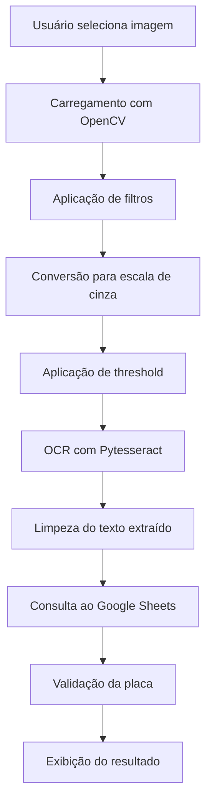

# 🚗 Sistema de Reconhecimento de Placas - Autorização de Veículos

Sistema inteligente de reconhecimento automático de placas veiculares com interface gráfica moderna, integrado ao Google Sheets para validação de veículos autorizados em tempo real.

## 📋 Descrição do Projeto

Este sistema utiliza **Computer Vision** e **OCR (Optical Character Recognition)** para:
- Detectar e extrair automaticamente números de placas de veículos em imagens
- Validar se a placa reconhecida está autorizada através de consulta ao Google Sheets
- Apresentar resultado visual através de interface gráfica moderna e intuitiva
- Processar imagens em diversos formatos (JPG, JPEG, PNG, BMP, WEBP)

### 🎯 Casos de Uso
- **Controle de acesso** em condomínios, empresas e estacionamentos
- **Monitoramento de frotas** autorizadas com controle de status
- **Segurança predial** com validação automática de veículos ativos
- **Gestão de estacionamentos** com controle de inadimplência
- **Administração condominial** com bloqueio automático de inadimplentes

## 🛠️ Tecnologias Utilizadas

### Backend e Processamento
- **Python 3.8+** - Linguagem principal
- **OpenCV** - Processamento de imagens e computer vision
- **Pytesseract** - OCR para extração de texto das placas
- **NumPy** - Operações matemáticas e manipulação de arrays

### Interface Gráfica
- **Tkinter** - Interface gráfica nativa do Python
- **TTK** - Componentes modernos para interface

### Integração e APIs
- **Google Sheets API** - Armazenamento e consulta de placas autorizadas
- **gspread** - Cliente Python para Google Sheets
- **oauth2client** - Autenticação com Google APIs

### Utilitários
- **Pillow (PIL)** - Manipulação adicional de imagens
- **Colorama** - Formatação colorida de saídas no terminal

## 📁 Estrutura do Projeto

```
plaque-detection-python-computer-vision/
├── README.md                   # Documentação do projeto
├── requirements.txt            # Dependências Python
├── LICENSE                     # Licença do projeto
├── .gitignore                 # Arquivos ignorados pelo Git
├── venv/                      # Ambiente virtual Python
└── src/                       # Código fonte
    ├── app_gui.py            # Aplicação principal com interface gráfica
    ├── credenciais.json      # Credenciais do Google Sheets (não versionado)
    └── lib/                  # Bibliotecas auxiliares
        ├── filters.py        # Filtros de processamento de imagem
        └── format_output.py  # Formatação de saídas
```

## 🚀 Instalação e Configuração

### 1. Clone do Repositório
```bash
git clone https://github.com/felipedpaula/plaque-detection-python-computer-vision.git
cd plaque-detection-python-computer-vision
```

### 2. Configuração do Ambiente Virtual
```bash
python3 -m venv venv
source venv/bin/activate  # Linux/Mac
# ou
venv\Scripts\activate     # Windows
```

### 3. Instalação de Dependências
```bash
pip install -r requirements.txt
```

### 4. Instalação do Tesseract OCR

#### Ubuntu/Debian:
```bash
sudo apt-get update
sudo apt-get install tesseract-ocr
sudo apt-get install libtesseract-dev
```

#### macOS:
```bash
brew install tesseract
```

#### Windows:
1. Baixe o instalador em: https://github.com/UB-Mannheim/tesseract/wiki
2. Instale e adicione ao PATH do sistema
3. Configure a variável de ambiente `TESSERACT_CMD`

### 5. Configuração do Google Sheets

#### 5.1 Criar Projeto no Google Cloud Console
1. Acesse [Google Cloud Console](https://console.cloud.google.com/)
2. Crie um novo projeto
3. Ative as APIs: **Google Sheets API** e **Google Drive API**

#### 5.2 Criar Conta de Serviço
1. Vá em **IAM & Admin > Service Accounts**
2. Clique em **Create Service Account**
3. Preencha os dados e clique em **Create and Continue**
4. Em **Keys**, clique em **Add Key > Create New Key**
5. Escolha formato **JSON** e baixe o arquivo

#### 5.3 Configurar Credenciais
1. Renomeie o arquivo baixado para `credenciais.json`
2. Mova para a pasta `src/` do projeto
3. No Google Sheets, compartilhe sua planilha com o email da conta de serviço

#### 5.4 Estrutura da Planilha
Sua planilha deve ter a seguinte estrutura:
```
| A (id) | B (placa)  | C (marca)     | D (modelo) | E (responsavel)  | F (status)     |
|--------|------------|---------------|------------|------------------|----------------|
| 1      | ABC1A23    | Ford          | Fiesta     | João Silva       | ativo          |
| 2      | XYZ9B87    | Chevrolet     | Onix       | Maria Oliveira   | ativo          |
| 3      | JKL2C34    | Toyota        | Corolla    | Pedro Andrade    | inadiplente    |
| 4      | RST7D56    | Honda         | Civic      | Ana Souza        | ativo          |
| 5      | MNO5E67    | Hyundai       | HB20       | Lucas Pereira    | ativo          |
| 6      | FJB4E12    | Nissan        | Kicks      | Sofia Costa      | inadiplente    |
| 7      | PLA0000    | Jeep          | Compass    | Bruno Almeida    | ativo          |
| 8      | BRAOS17    | Volkswagen    | Polo       | Carolina Lima    | ativo          |
| 9      | FUN-0972   | Fiat          | Argo       | Fernanda Santos  | inadiplente    |
| 10     | BRA2E19    | Renault       | Kwid       | Rafael Mendes    | ativo          |
```
**Importante:** 
- As placas devem estar na **coluna B** (segunda coluna)
- O sistema verifica apenas veículos com status **"ativo"** para autorização
- Placas com status "inadiplente" são automaticamente negadas

## 🎮 Como Usar

### Execução do Sistema
```bash
cd src/
source ../venv/bin/activate
python app_gui.py
```

### Interface do Usuário

#### 1. **Tela Principal**
- Header com título do sistema
- Card de upload para seleção de imagem
- Área de análise com botão de processamento
- Card de resultado com status da validação

#### 2. **Fluxo de Uso**
1. **Selecionar Imagem**: Clique em "SELECIONAR IMAGEM" e escolha uma foto da placa
2. **Analisar**: Clique em "ANALISAR PLACA" para iniciar o processamento
3. **Resultado**: Visualize se a placa está AUTORIZADA ou NÃO AUTORIZADA

#### 3. **Tipos de Resultado**
- ✅ **AUTORIZADA**: Placa encontrada na lista do Google Sheets com status "ativo"
- ❌ **NÃO AUTORIZADA**: Placa não encontrada na lista ou com status "inadiplente"
- ⚠️ **ERRO**: Problemas na leitura da imagem ou OCR

## 🔧 Arquitetura Técnica

### Fluxo de Processamento



### Componentes Principais

#### 1. **PlateRecognitionGUI** (Classe Principal)
- Gerencia toda a interface gráfica
- Controla o fluxo de processamento
- Integra com Google Sheets

#### 2. **Processamento de Imagem** (`lib/filters.py`)
```python
def get_grayscale(image):
    """Converte imagem para escala de cinza"""
    
def thresholding(image):
    """Aplica threshold binário para melhorar OCR"""
```

#### 3. **OCR e Validação**
```python
def scan_plate(image):
    """Extrai texto da placa usando Pytesseract"""
    
def validate_plate(plate_number):
    """Valida placa contra lista do Google Sheets (apenas status 'ativo')"""
```

### Lógica de Validação
1. **Extração**: OCR extrai texto da placa da imagem
2. **Normalização**: Remove hífens, espaços e converte para maiúsculas
3. **Consulta**: Busca a placa na planilha do Google Sheets
4. **Verificação de Status**: Aceita apenas veículos com status "ativo"
5. **Resultado**: Retorna AUTORIZADA (ativo) ou NÃO AUTORIZADA (inexistente/inadiplente)

### Configurações do OCR
- **Blacklist**: Remove caracteres minúsculos e símbolos
- **PSM 6**: Modo de segmentação para bloco de texto uniforme
- **Limpeza**: Remove tudo exceto letras maiúsculas e números

### Componentes Visuais
- **Header**: Título e subtítulo do sistema
- **Upload Card**: Área de seleção de imagem com preview
- **Analysis Card**: Botão de processamento com barra de progresso
- **Result Card**: Exibição do resultado da análise

## 📝 Dependências (requirements.txt)

```txt
opencv-python==4.8.1.78
pytesseract==0.3.10
gspread==5.11.3
oauth2client==4.1.3
numpy==1.24.3
Pillow==10.0.1
colorama==0.4.6
```

## 🔒 Segurança

### Arquivos Sensíveis
- `credenciais.json` está no `.gitignore`
- Não commitar chaves de API
- Usar conta de serviço com permissões mínimas

### Boas Práticas
- Ambiente virtual isolado
- Validação de entrada de dados
- Tratamento de exceções
- Logs de erro estruturados

## 🚨 Solução de Problemas

### Erro: "No module named 'lib.filters'"
```bash
# Certifique-se de executar da pasta src/
cd src/
python app_gui.py
```

### Erro: "Tesseract not found"
```bash
# Ubuntu/Debian
sudo apt-get install tesseract-ocr

# Verificar instalação
tesseract --version
```

### Erro: "Google Sheets connection failed"
1. Verifique se `credenciais.json` está em `src/`
2. Confirme se as APIs estão ativadas
3. Verifique se a planilha foi compartilhada com a conta de serviço

### Erro: "Permission denied"
```bash
# Ativar ambiente virtual
source venv/bin/activate

# Verificar permissões
ls -la src/
```

## 🤝 Contribuição

1. Fork o projeto
2. Crie uma branch: `git checkout -b feature/nova-funcionalidade`
3. Commit: `git commit -m 'Adiciona nova funcionalidade'`
4. Push: `git push origin feature/nova-funcionalidade`
5. Abra um Pull Request

## 👨‍💻 Autor

**Felipe Paula**
- GitHub: [@felipedpaula](https://github.com/felipedpaula)
- LinkedIn: [Felipe Paula](https://www.linkedin.com/in/felipe-de-paula-palmeira-633a87142/)

---